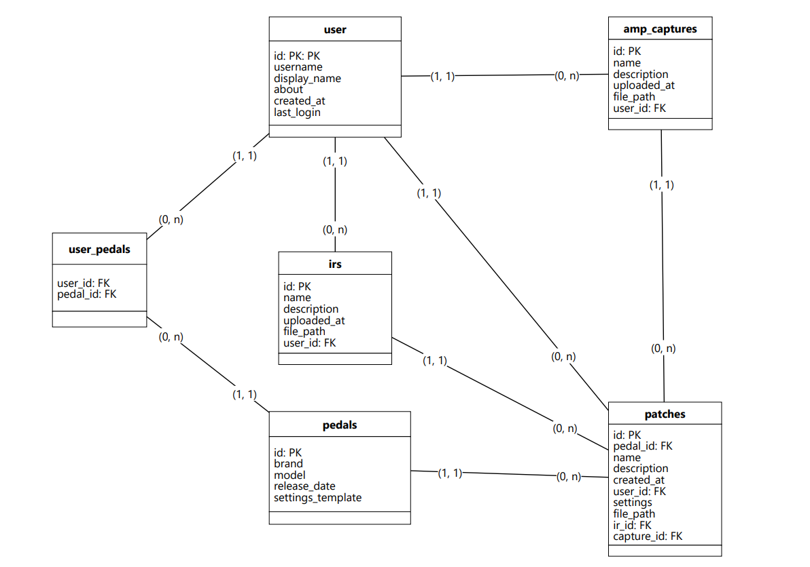

# 🎸 PedalPatches

> Um gerenciador de patches e setups de guitarra construído sobre uma arquitetura MVC própria.


## 📖 Sobre o Projeto

O **PedalPatches** é uma aplicação web desenvolvida para catalogar e compartilhar configurações de pedais de guitarra. 

O diferencial deste projeto é sua engenharia: em vez de utilizar frameworks prontos (como Laravel ou Symfony), toda a estrutura **MVC (Model-View-Controller)** foi construída do zero ("from scratch"). O objetivo foi estudar a fundo o ciclo de vida de uma requisição HTTP, autoloading, gerenciamento de dependências e padrões de projeto.

## ✨ Funcionalidades e Arquitetura

- **Arquitetura MVC Pura:** Separação clara entre Lógica de Negócios, Controladores e Visualização.
- **Router Customizado:** Sistema de rotas dinâmicas com suporte a Expressões Regulares (Regex) para URLs amigáveis.
- **Banco de Dados Seguro:** Conexão via PDO com *Prepared Statements* para prevenção de SQL Injection.
- **Performance:**
  - Integração com **Redis** para caching de consultas pesadas.
  - Otimização via **JIT Compiler** (PHP 8).
- **Variáveis de Ambiente:** Gestão segura de credenciais usando `phpdotenv`.
- **Frontend Moderno:** Estilização com **Tailwind CSS** compilado via NPM.

## 🛠️ Tecnologias Utilizadas

- **Back-end:** PHP 8.3+
- **Gerenciador de Dependências:** Composer
- **Banco de Dados:** MySQL
- **Cache:** Redis (Biblioteca `predis/predis`)
- **Front-end:** HTML5, Tailwind CSS
- **Servidor Web:** Apache (WAMPP/Laragon) ou PHP Built-in Server

## 🗄️ Arquitetura do Banco de Dados

O banco de dados do **PedalPatches** foi estruturado para ser relacional, permitindo que os usuários salvem e compartilhem suas configurações de pedais, *Impulse Responses* (IRs) e capturas de amplificadores.

Abaixo está o nosso Diagrama Entidade-Relacionamento (ERD):



* **users**: Armazena os dados de autenticação e perfil.
* **pedals**: Catálogo base de pedais disponíveis (marca, modelo).
* **patches / irs / amp_captures**: Entidades centrais onde as configurações customizadas dos usuários são salvas e vinculadas aos equipamentos.

## 🚀 Como Rodar o Projeto

### Pré-requisitos
Certifique-se de ter instalado:
- PHP 8.0 ou superior
- Composer
- Node.js & NPM
- Servidor MySQL e Redis

### Instalação

1. **Clone o repositório:**
   ```bash
   git clone [https://github.com/JhonathanHU3/pedalpatches]
   cd pedalpatches
2. **Instale as dependências do PHP:**
    ```bash
    composer install
3. **Instale e compile o Tailwind CSS:**

    ```Bash
    npm install
    # Para rodar em modo de desenvolvimento (watch)
    npm run watch
4. **Configure o Ambiente:**

    Renomeie o arquivo .env.example para .env e configure suas credenciais:

    ````bash
    Snippet de código
    DB_HOST=127.0.0.1
    DB_NAME=pedalpatches
    DB_USER=root
    DB_PASS=
5. **Crie as tabelas do Banco de Dados:**
    Execute o script de migração na raiz do projeto:

    ````Bash
    php migrate.php
6. **Inicie o Servidor:**
    Você pode usar o servidor embutido do PHP para testar:
    ````Bash
    php -S localhost:8000
    ````
    Acesse http://localhost:8000 no seu navegador.

**📂 Estrutura de Pastas**
   ````bash
    /pedalpatches
    │
    ├── /App                 # Núcleo da Aplicação
    │   ├── /Config          # Configurações (Database, Router)
    │   ├── /Controllers     # Controladores das Rotas
    │   ├── /Models          # Lógica de Dados e SQL
    │   └── /Views           # Arquivos de Visualização (HTML/PHP)
    │
    ├── /public              # Arquivos públicos (CSS, JS, Imagens)
    ├── /resources           # Assets não compilados (Tailwind input)
    ├── /vendor              # Dependências do Composer
    │
    ├── .env                 # Variáveis de ambiente (NÃO COMITAR)
    ├── composer.json        # Dependências PHP
    ├── tailwind.config.js   # Configuração do Tailwind
    ├── migrate.php          # Script de migração do banco de dados
    └── index.php            # Ponto de entrada (Front Controller)

````
### Desenvolvido por Jhonathan Pimenta